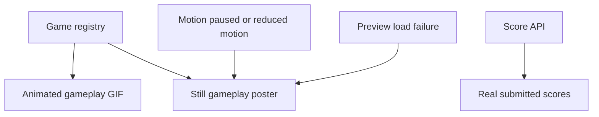

# Arcade asset provenance

 

The arcade combines supplied ShoeMoney branding with Last Engineer's gameplay captures and share artwork. This inventory describes files currently present, not planned placeholders.

| Arcade asset | Source and use |
|---|---|
| `public/brand/shoemoney-robot.webp` | Byte-identical to `../shoemoneyx/public/brand/shoegpt-robot-armor.webp`; supplied ShoeMoney robot branding |
| `public/brand/last-engineer-gameplay.gif` | Shipped animated gameplay preview: 50 frames at 560 × 350 |
| `public/brand/last-engineer-gameplay.png` | Current registry poster: still gameplay capture at 960 × 600 |
| `public/brand/last-engineer-still.png` | Earlier 1280 × 720 game screenshot from `../shoeinator-web/verify/branding/audio-rampage.png`; retained but not the active registry poster |
| `public/brand/last-engineer-og.jpg` | 1200 × 630 share artwork, byte-identical to the game project's corresponding public asset |
| `public/favicon.ico` | Byte-identical to the game project's favicon |
| `public/favicon-32.png` | Byte-identical to the game project's 32-pixel favicon |
| `public/apple-touch-icon.png` | Byte-identical to the game project's touch icon |
| Font Awesome icons | Official `@fortawesome` npm packages; retain their upstream license notices |

The shared game assets above resolve against `../shoeinator-web/public/`. Shared branding is not a blanket license grant for unrelated reuse; consult the game repository's licensing and asset notices when redistributing it.

## Runtime presentation

The frontend chooses the GIF while motion is enabled. Paused motion, initial reduced-motion preference, or a failed preview load selects the registered poster. Score rows come from `/api/games/{slug}/scores`; the interface has loading, empty, and error states and does not invent sample scores.

Maintaining this inventory

When replacing a capture, update both preview and poster in `src/games.json`, keep the registry paths consistent, and verify that the GIF contains actual gameplay. Record the source of new artwork here. Media signatures are worth checking, but they do not establish rights or validate that a capture represents the game.

