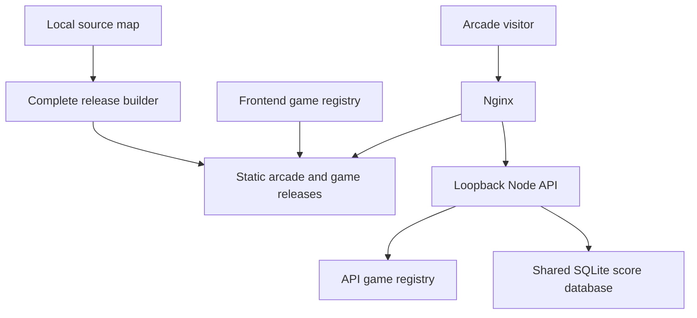

# ShoeMoney Arcade

   

**All game. No quarters.** Free browser games, actual gameplay previews, and a score board worth chasing.

[Visit the arcade](https://arcade.shoemoney.com/) · [Play Last Engineer](https://arcade.shoemoney.com/last-engineer/) · [Last Engineer source](https://github.com/shoemoney/SMA-last-engineer)

| Explore | Build | Operate |
|---|---|---|
| [Experience](#the-experience) | [Development](#development) | [Release workflow](#release-workflow) |
| [Architecture](#architecture) | [Add a game](#add-a-game) | [API reference](api/README.md) |
| [Asset provenance](ASSET-PROVENANCE.md) | [Verification](#verification) | [Production layout](#production-layout) |

## The experience

| Feature | Current behavior |
|---|---|
| ShoeMoney identity | Armored robot, cyan-and-amber effects, and a WebGPU ambient field with a CSS fallback |
| Gameplay previews | Animated captures with still-image fallback; motion controls also switch previews to stills |
| Game rows | Preview and scores alternate sides by registry position |
| Play | **Test your skill** opens `/<game-slug>/` |
| High scores | Highest 10 per game and scoring version; ties favor earlier submissions |
| Score entry | Last Engineer checks version 2 eligibility after game over; only qualifying runs offer name entry |
| Persistence | SQLite lives outside releases and survives deployments |
| Source | The game is public as `SMA-last-engineer`; this arcade directory is a separate local project |

Scores are reported by the player's browser. Run tokens, validation, and duplicate protection support a casual leaderboard; they do not prove fair gameplay. The board shows the **highest ten**, not the ten most recent submissions. Accepted scores outside the displayed ten remain stored. Last Engineer version 2 ranks completed waves plus a bounded combat-time bonus. Version 1 results remain available separately, and SMTD keeps its existing version 1 scoring. Boards refresh on focus, tab visibility, and successful same-origin score broadcasts.

## Architecture



| File | Responsibility |
|---|---|
| `src/App.vue` | Catalog, previews, score loading/error states, motion controls |
| `src/arcade-field.js` | WebGPU background and fallback handling |
| `src/games.json` | Ordered catalog, descriptions, preview/poster URLs, play links |
| `api/games.json` | Allowed game slugs and leaderboard limits |
| `api/server.mjs` | Run tokens, frozen qualification, versioned rankings, SQLite persistence |
| `api/rankedScore.mjs` | Last Engineer version 2 completed-wave and combat-time formula |

## Development

Use Node 22.13+ for the API, a Node version supported by the installed Vite release, npm, and Python 3 for release tooling.

```sh
npm ci
npm run dev -- --port 5174
```

In a second terminal, from this directory:

```sh
ARCADE_DB_PATH=/tmp/arcade-dev.sqlite \
ARCADE_DEV_ORIGIN=http://127.0.0.1:5174 \
PORT=3784 node api/server.mjs
```

Open `http://127.0.0.1:5174`. Vite proxies `/api` to port 3784. To play Last Engineer locally, start its development server on port 5173; the arcade's development proxy forwards `/last-engineer` there. The production-preview proxy covers `/api` only.

<details>
<summary>Why the explicit API port matters</summary>

The standalone API defaults to **3012**. Both the arcade's Vite proxy and the production service use **3784**. Set `PORT=3784` for the development commands above. The server binds to `127.0.0.1` in code; it does not read a `HOST` environment override.

</details>

## Add a game

Use the installed `upload-to-arcade` skill for the full upload workflow. Game repositories follow `SMA-<slug>`; published URLs follow `https://arcade.shoemoney.com/<slug>/`.

A game is registered by adding it to two registries, both of which ARE published here:

| File | What it holds |
|---|---|
| `src/games.json` | Ordered catalog entry: slug, title, description, genre, preview/poster URLs, play link |
| `api/games.json` | Allowed slug and its leaderboard limit — the API rejects any slug not listed |

Add the entry to both, drop a GIF preview and a still poster into `public/`, and build. The
registration helper that automates this in the maintained copy is part of the unpublished
deployment tooling; doing it by hand is two JSON edits.

Registration alone does **not** give a game score submission: implement the
[run and score API](api/README.md#request-flow) in the game itself. The current UI carries
Last Engineer-specific subtitle and preview alt text, so generalize that copy when adding a game
in another setting or genre.

## Release workflow and production layout

Deployment tooling is **not published**. It hardcodes the production host, the deploy key path and
the on-disk service layout — nothing secret in the cryptographic sense, but a map of one specific
box that is of no use in a fork.

What a fork needs to know instead: the frontend is a static Vite build, the API is a single Node
process that binds `127.0.0.1` and owns one SQLite file, and the two are joined by a reverse proxy
that serves the static root and forwards `/api`. Point `ARCADE_DB_PATH` at a writable location,
put the build output behind any web server, and it runs.

## Verification

```sh
npm test --prefix api
npm run build   # the published tree: frontend build
node api/test.mjs  # the published tree: API suite
npm run build
```

API tests exercise real SQLite persistence, legacy migration, version isolation, SMTD compatibility, qualification and concurrent cutoff changes, idempotent replay, expiry, clock bounds, validation, origin checks, body limits, and rate limits. Tooling tests exercise registration and release-building fixtures. Game tests run in the game project separately.

The initial release was checked on desktop/mobile, with reduced motion and renderer fallback, and a live name submission survived redeployment before its test entry was removed. Those are release-history checks, not a promise that every subsequent deployment has been verified. After publishing, check the homepage, game launch, score submission, and stored-score persistence again.

**Free games. Serious bragging rights.**
